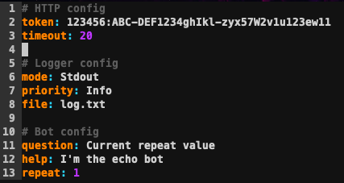

# echoBot

## Table of contents
* [Introduction](#Introduction)
* [Setup](#setup)
* [Features](#features)

## Introduction
This is a simple telegram bot, that just echoes back whatever you send it.

## Setup
At first, you have to build the project, using the stack tool:
```
$ stack build
```
Then, you have to create the file, called *config.yaml* with the following field:
- token - token of the telegram bot
- timeout - long polling timeout (some integer)
- mode - logger mode (Stdout | File | Both)
- priority - log level (None | Debug | Error | Warn | Info)
- file - log file name
- help - text for the /help command
- question - question for the /repeat command
- repeat - default repeat value (from 1 to 5)



Now, you can start the bot using that command:
```
$ stack exec echoBot-exe
```

## Features
1. If you send a message to the bot, it will echo it back several times (as specified by the /repeat command or default repeat value)
2. /help command is intended to tell the bot usage to the user, the text is specified by the config file
3. You can specify the number of echoes with the /repeat command.
